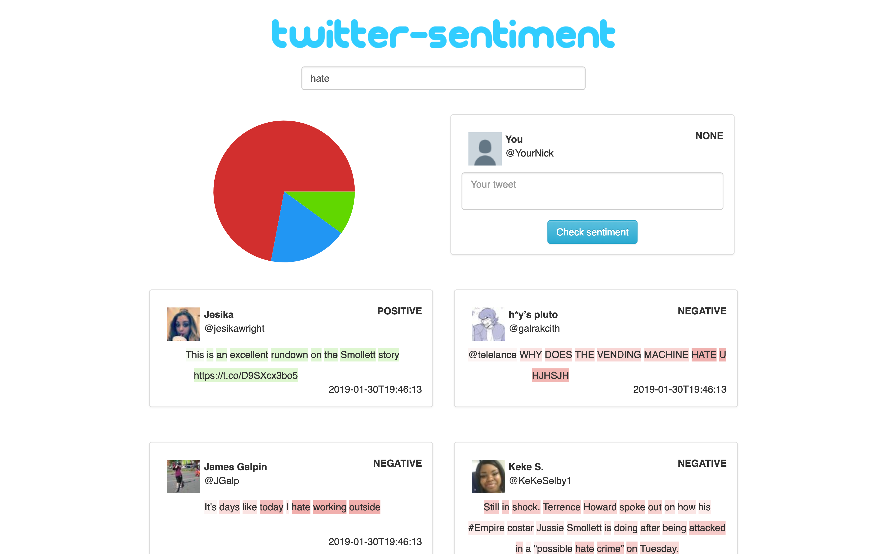
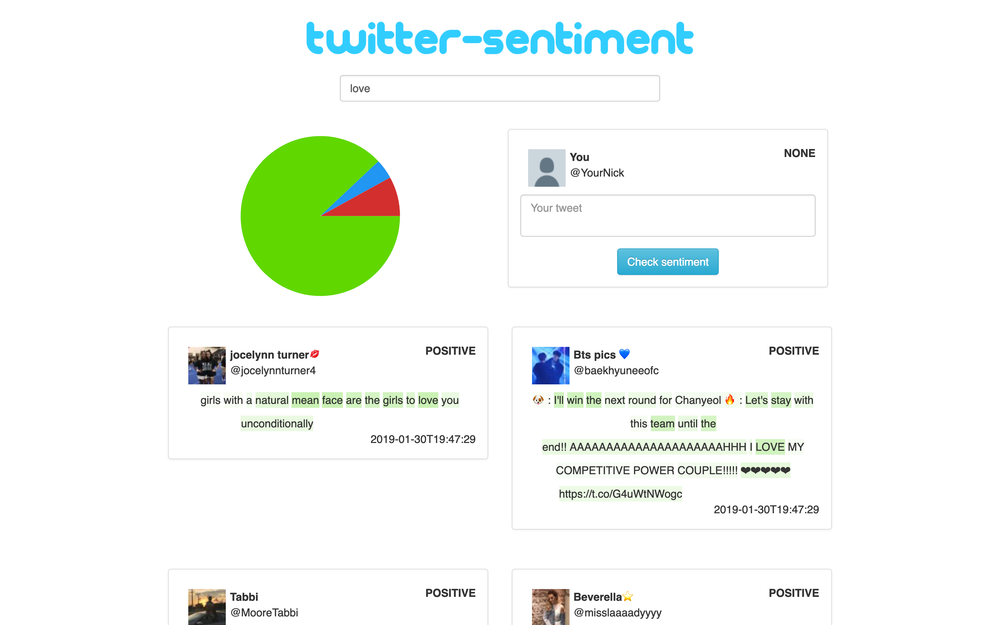
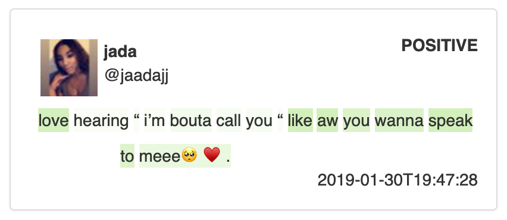

Twitter Sentiment Analysis
==========================

An example use of sentiment analysis applied to the latest Tweets. Application uses LSTM with
 Attention layer to draw between positive and negative feeback from a given Tweet. Also, it
 can show which words were most impactful during analysis based on internal attention values.

## Screenshots

#### Example search results for "hate"



#### Example search results for "love"



#### Tweets sentiment coloring



#### Custom Tweet analysis


## How to run web-app?

```bash
$ cd ./web-app
$ npm install
$ npm start
```

Need more info about web-app project? Check out [general project info](/web-app/README.md).

## How to train the model?

To train your model, please follow below commands:

```bash
$ cd ./training
$ virtualenv -p python3.6 venv
$ . venv/bin/activate
(venv) $ pip install pandas keras tensorflow sklearn nltk swifter
(venv) $ cd ./dataset && wget http://cs.stanford.edu/people/alecmgo/trainingandtestdata.zip
(venv) $ unzip trainingandtestdata.zip
(venv) $ cd ..
(venv) $ export NLTK_DATA=./nltk/
(venv) $ python prepare_dataset.py
(venv) $ python train.py
```

## How to run the API?

At first copy your model from above training together with `tokenizer.pickle` to the `./api/model_data` directory.
 Remember to change the name of you model to `weights.h5`! Folder should look like this:

```
$ ls ./api/model_data/
-rw-r--r--  1 owner  owner   5.9K Jan 18 00:09 tokenizer.pickle
-rw-r--r--  1 owner  owner    13M Jan 18 00:10 weights.h5
```

**NOTE:** This repository already contains pretrained model weights and tokenizer, so feel free to use it!

To run the API, use below series of commands:

```bash
$ cd ./api
$ virtualenv -p python3.6 venv
$ . venv/bin/activate
(venv) $ pip install tweepy flask-restplus flask-cors keras tensorflow nltk
(venv) $ export CONSUMER_KEY={YOUR_CONSUMER_KEY}
(venv) $ export CONSUMER_SECRET={YOUT_CONSUMER_SECRET}
(venv) $ export ACCESS_TOKEN={YOUR_ACCESS_TOKEN}
(venv) $ export ACCESS_TOKEN_SECRET={YOUR_ACCESS_TOKEN_SECRET}
(venv) $ export NLTK_DATA=./nltk/
(venv) $ python main.py
```

Open your browser and visit Swagger page under [http://127.0.0.1:5000](http://127.0.0.1:5000).

## Example API calls

Here you can find some example endpoints that we've prepared:

#### Get Trendings for given country

**NOTE:** Only `UK` and `USA` are supported for now!

`GET` -> `http://127.0.0.1:5000/trending/UK`

```json
[
  {
    "name": "Soulja Boy",
    "query": "%22Soulja+Boy%22",
    "volume": 112724
  },
  {
    "name": "Bielsa",
    "query": "Bielsa",
    "volume": 79883
  },
  {
    "name": "Marcelo",
    "query": "Marcelo",
    "volume": 60846
  },
  {
    "name": "#JuveMilan",
    "query": "%23JuveMilan",
    "volume": 34641
  }
]
```

#### Get Tweets with sentiment analysis

`GET` -> `http://127.0.0.1:5000/tweets?query=hate&size=3`

```json
[
  {
    "text": "i hate people",
    "sentiment": "NEGATIVE",
    "attention": [
      0.06718742102384567,
      0.4514390826225281,
      0.4514661729335785
    ],
    "fullname": "jen",
    "nickname": "iamabandito",
    "created": "2019-01-22T20:32:39",
    "photo_url": "http://pbs.twimg.com/profile_images/1086319779382743040/MhRt4ims_normal.jpg"
  },
  {
    "text": "I hate that being a “morning person” is seen as being the most productive. I work better at night, I work better when I’ve slept in, I enjoy leisure mornings. I am not a morning person period.",
    "sentiment": "NEUTRAL",
    "attention": [
      0.03465234488248825,
      0.2328326255083084,
      0.23284660279750824,
      0.229080468416214,
      0.20134896039962769,
      0.1602855920791626,
      0.1254456341266632,
      0.1011728048324585,
      0.11189230531454086,
      0.16113440692424774,
      0.09171538800001144,
      0.08485584706068039,
      0.0928933247923851,
      0.1442396193742752,
      0.21461866796016693,
      0.23283472657203674,
      0.11889468878507614,
      0.17596875131130219,
      0.17660245299339294,
      0.19103240966796875,
      0.23278631269931793,
      0.04326930269598961,
      0.15518422424793243,
      0.2036893367767334,
      0.04577045887708664,
      0.05624167248606682,
      0.07582158595323563,
      0.2034529596567154,
      0.06726902723312378,
      0.23272675275802612,
      0.14504748582839966,
      0.19384515285491943,
      0.17640644311904907,
      0.1585114300251007,
      0.23276740312576294,
      0.041838016360998154,
      0.06722453981637955
    ],
    "fullname": "c",
    "nickname": "cxxlvndivvxx",
    "created": "2019-01-22T20:36:31",
    "photo_url": "http://pbs.twimg.com/profile_images/1074561986774544384/o3qw24Ve_normal.jpg"
  },
  {
    "text": "I love your voice but I hate when you speak",
    "sentiment": "POSITIVE",
    "attention": [
      0.05682794377207756,
      0.38138285279273987,
      0.25030916929244995,
      0.05787074193358421,
      0.05518733337521553,
      0.08842664957046509,
      0.3818563222885132,
      0.38185766339302063,
      0.38039451837539673,
      0.3818225860595703
    ],
    "fullname": "𝐤𝐠 ¡𝐭𝐨𝐦𝐨𝐫𝐫𝐨𝐰!",
    "nickname": "theblcony",
    "created": "2019-01-22T20:36:30",
    "photo_url": "http://pbs.twimg.com/profile_images/1086472744513011712/u44lGkLA_normal.jpg"
  }
]
```

#### Get Tweets with sentiment analysis

`GET` -> `http://127.0.0.1:5000/custom_tweet?content=I%20love%20trains%20and%20potatoes!`

```json
[
  {
    "text": "I love trains and potatoes!",
    "sentiment": "POSITIVE",
    "attention": [
      0.06628784537315369,
      0.4448699355125427,
      0.4144006073474884,
      0.15626297891139984,
      0.1030135452747345
    ]
  }
]
```
